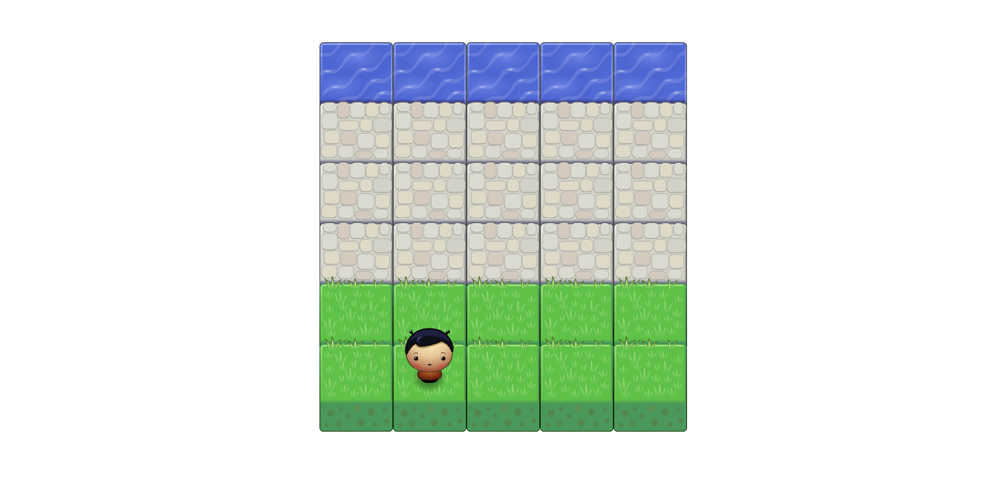
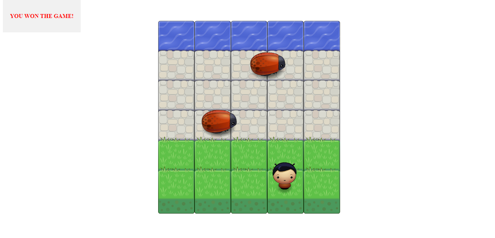

# Udacity-fend arcade game project

Udacity (Front-End Web Developer Nanodegree Project): Arcade Game.

## How to play

In this game you have a Player and Enemies (Bugs). The goal of the player is to reach the water, without colliding into any one of the enemies. The player can move left, right, up and down. The enemies move in varying speeds on the paved block portion of the scene. Once a the player collides with an enemy, the game is reset and the player moves back to the start square. Once the player reaches the water the game is won.

You can play the game from [here](https://magdi-mohammed.github.io/udacity-fend-project-classic-arcade-game/)
or you can [clone](https://github.com/magdi-mohammed/udacity-fend-project-classic-arcade-game) it.

### Screenshots

-   Game start screen

-   Won the game action

